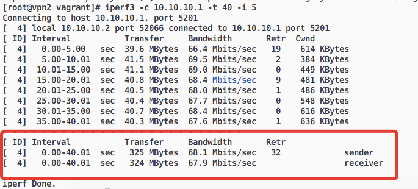
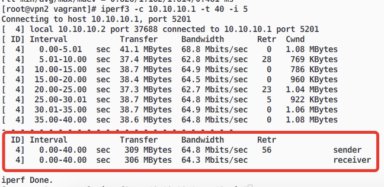

# Мосты, туннели, VPN

Задание:

VPN

1.  Между двумя виртуалками поднять vpn в режимах

-   tun
-   tap
    Прочуствовать разницу.

2.  Поднять RAS на базе OpenVPN с клиентскими сертификатами, подключиться с локальной машины на виртуалку

Выполнение:

* * *

Стенд запускается командой vagrant up

* * *

### Между двумя виртуалками поднять vpn

Установим репозиторий epel на всех машинах:  
`yum install -y epel-release`  
Установим пакеты openvpn, iperf3, policycoreutils-python на всех машинах:  
`yum install -y openvpn iperf3 policycoreutils-python`  

#### Настройка сервера openvpn:

создаём файл-ключ:  
`root@vpn1: openvpn --genkey --secret /etc/openvpn/static.key`  

Настроим сервер на работу в режиме tun:  
`root@vpn1: cat /etc/openvpn/server-tun.conf`  

    dev tun
    port 3876
    ifconfig 10.10.10.1 255.255.255.0
    topology subnet
    secret /etc/openvpn/static.key
    comp-lzo
    status /var/log/openvpn-status.log
    log /var/log/openvpn.log
    verb 3

Запускаем openvpn сервер с нашими настройками:  
`root@vpn1: systemctl enable --now openvpn@server-tun`  

Настроим selinux:  
`root@vpn1: semanage port -a -t openvpn_port_t -p udp 3876`

#### Настройка клиента:

`root@vpn2: cat /etc/openvpn/client-tun.conf`  

    dev tun
    remote 192.168.101.10 3876
    ifconfig 10.10.10.2 255.255.255.0
    topology subnet
    route 192.168.101.0 255.255.255.0
    secret /etc/openvpn/static.key
    comp-lzo
    status /var/log/openvpn-status.log
    log /var/log/openvpn.log
    verb 3

Скопируем static.key с сервера openvpn в директорию клиента /etc/openvpn/

Запускаем openvpn клиент с нашими настройками:  
`root@vpn2: systemctl enable --now openvpn@server-tun`

Настроим selinux:  
`root@vpn2: semanage port -a -t openvpn_port_t -p udp 3876`

Проверим тип openvpn соединения:  
`ip tuntap`  

    tun0: tun one_queue

Проверим скорость соединения в данном режиме работы openvpn:  
На сервере запускаем команду:  
`root@vpn1: iperf3 -s`

На клиенте запускаем:  
`iperf3 -c 10.10.10.1 -t 40 -i 5`

Результаты представлены на скриншоте:  

Заменим в конфигурационных файлах интерфейс dev tun на dev tap и запустим `ansible-playbook playbook.yml` на хостовой машине.

Проверим командой:  
`ip tuntap`

    tap0: tap one_queue

Аналогично проверим скорость соединения. Результат на скриншоте:  

Выводы:

-   Скорость соединения (в моем случае) не сильно зависит от типа интерфейса.
-   Интерфейс tap работает на канальном уровне и может использоваться например в мостовых соединениях для объединения ethernet сетей.
-   Интерфейс tun работает на сетевом уровне и применяется в большинстве остальных случаев.

* * *

### Поднять RAS на базе OpenVPN

Запустим машину vpn3 и установим дополнительно на ней пакет easy-rsa:  
`yum install -y easy-rsa`

Далее последовательно выполняем команды:  

    cd /etc/openvpn
    /usr/share/easy-rsa/3.0.7/easyrsa init-pki
    echo 'rasvpn' | /usr/share/easy-rsa/3.0.7/easyrsa build-ca nopass
    echo 'rasvpn' | /usr/share/easy-rsa/3.0.7/easyrsa gen-req server nopass
    echo 'yes' | /usr/share/easy-rsa/3.0.7/easyrsa sign-req server server
    /usr/share/easy-rsa/3.0.7/easyrsa gen-dh
    /usr/share/easy-rsa/3.0.7/easyrsa gen-dh
    echo 'client' | /usr/share/easy-rsa/3.0.7/easyrsa gen-req client nopass
    echo 'yes' | /usr/share/easy-rsa/3.0.7/easyrsa sign-req client client

Настраиваем сервер openvpn:  
`root@vpn3: cat /etc/openvpn/server-ras.conf`

    port 3876
    proto udp
    dev tun
    ca /etc/openvpn/pki/ca.crt
    cert /etc/openvpn/pki/issued/server.crt
    key /etc/openvpn/pki/private/server.key
    dh /etc/openvpn/pki/dh.pem
    server 10.10.10.0 255.255.255.0
    ifconfig-pool-persist ipp.txt 0
    client-to-client
    client-config-dir /etc/openvpn/client
    keepalive 10 120
    comp-lzo
    persist-key
    persist-tun
    tls-server
    status /var/log/openvpn-status.log
    log /var/log/openvpn.log
    verb 3

Настроим selinux:  
`root@vpn3: semanage port -a -t openvpn_port_t -p udp 3876`

Запускаем openvpn сервер с нашими настройками:  
`root@vpn3: systemctl enable --now openvpn@server-ras`

Переписываем следующие файлы на хостовую машину:

    /etc/openvpn/pki/ca.crt
    /etc/openvpn/pki/issued/client.crt
    /etc/openvpn/pki/private/client.key

и создаём файл конфигурации с настройками подключения на хостовой машине:  
`cat ~/client.conf`

    dev tun
    proto udp
    remote 192.168.101.12 3876
    client
    remote-cert-tls server
    resolv-retry infinite
    ca /etc/openvpn/pki/ca.crt
    cert /etc/openvpn/pki/issued/client.crt
    key /etc/openvpn/pki/private/client.key
    route 192.168.101.0 255.255.255.0
    persist-key
    persist-tun
    comp-lzo
    verb 3

После этого подключаемся с хостовой машины к серверу openvpn:  
`openvpn --config ~/client.conf`

Проверяем маршрут командой `ping 10.10.10.1`

## Спасибо за проверку!
